<div align="center">



<br><br>

[](https://github.com/baylox/its-not-skynet/actions/workflows/validate.yml)
[](LICENSE)
[](CONTRIBUTING.md)
[](#why-this-repo)

**[Quick start](#quick-start)** · **[What's inside](#whats-inside)** · **[Contribute with an agent](#contribute-with-an-agent)** · **[Tooling](#tooling)** · **[Philosophy](#why-this-repo)**

🇫🇷 [Version française](docs/README.fr.md)

</div>


## Why this repo

The CLI/AI ecosystem is full of copy-pasted configs, untested hooks, and skills that "worked on someone's machine." **its-not-skynet** takes the opposite stance: every resource has been **created or tested in real conditions** by its author.

> [!IMPORTANT]
> **One rule, non-negotiable:** a resource is either **created** or **explicitly validated** by its contributor. Nothing imported blindly. Nothing that depends on an uncontrolled network at runtime.

A trust catalog for anyone working with CLI AI agents — Claude Code, Codex CLI, Antigravity CLI, MCP, Ollama, or any other tool.


## What's inside

| Folder | Description |
|--------|-------------|
| [`hooks/`](hooks/README.md) | Shell scripts triggered by Claude Code — `PreToolUse`, `PostToolUse`, `Notification`… |
| [`skills/`](skills/README.md) | Reusable skills: slash commands and specialized agents |
| [`configs/`](configs/README.md) | Ready-to-copy config files — `settings.json`, `.mcp.json`, Ollama… |
| [`subagents/`](subagents/README.md) | Specialized subagent definitions |
| [`architecture/`](architecture/README.md) | Architecture schemas and decisions |

Every resource lives in `<type>/<contributor-handle>/<name>/` and ships a **`META.md`** — author, status, usage, installation, tested environment. That file is the single entry point to understand and install it.

**Browse it all** in [`CATALOG.md`](CATALOG.md) (auto-generated, with stats), or search from the terminal:

```bash
bash scripts/find.sh -t hooks -s stable        # stable hooks only
bash scripts/find.sh laravel                   # keyword search
```


## Quick start

**1.** Pick a resource in [`CATALOG.md`](CATALOG.md) or the folder that interests you.
**2.** Read its `META.md`.
**3.** Install it — one command, no copy-paste:

```bash
bash scripts/install.sh skills/<handle>/<name> /path/to/your/project
```

…or wire it manually. Example for a hook, in `.claude/settings.json`:

```jsonc
{
  "hooks": {
    "PreToolUse": [
      {
        "matcher": "Bash",
        "hooks": [
          { "type": "command", "command": "bash \"$CLAUDE_PROJECT_DIR/hooks/Baylox/no_coauthor/hook.sh\"" }
        ]
      }
    ]
  }
}
```

> [!TIP]
> `$CLAUDE_PROJECT_DIR` is exposed natively by Claude Code — no `.env` required.


## Contribute with an agent

<div align="center">

</div>

Open this repo in your CLI agent of choice and describe what you want:

> *"I want a hook that blocks commits on Fridays"*

The agent reads the project context file and generates the full structure following repo conventions:

```
hooks/<your-handle>/pre_tool_use_block_friday_commit/
├── pre_tool_use_block_friday_commit.sh
└── META.md
```

Each agent CLI has its own context file:

| Agent | Context file |
|-------|-------------|
| Claude Code | [`CLAUDE.md`](CLAUDE.md) |
| Codex CLI | [`AGENTS.md`](AGENTS.md) |
| Antigravity CLI | [`ANTIGRAVITY.md`](ANTIGRAVITY.md) |

> [!NOTE]
> Generated files are always **drafts**. `META.md` status stays `draft` until **you** have run the resource in real conditions. No commit before human validation — that's the repo's promise.

**You stay in control, the agent does the plumbing.**

Prefer doing it by hand? Fork, create your `<type>/<handle>/<name>/` folder, add a `META.md` (template in [CONTRIBUTING.md](CONTRIBUTING.md)), test in real conditions, open a PR.


## Tooling

Pure-shell helpers under [`scripts/`](scripts/) — deterministic, no network, no dependencies beyond coreutils (`jq` optional). The catalog of validated CLI tools gets its own validated CLI tools.

| Script | What it does |
|--------|-------------|
| `doctor.sh` | **Start here.** Pre-PR health check: lint + catalog sync + security audit, with actionable messages. `--new <type> <handle> <name>` scaffolds → opens `$EDITOR` → lints in one go. |
| `new.sh` | Scaffolds a resource (`new.sh <type> <handle> <name>`): folder + pre-filled `META.md` (status `draft`) + stub. Skills get a trigger-oriented description and a `references/` folder. |
| `install.sh` | Installs a resource into a target project: skill → `.claude/skills/<name>/`, subagent → `.claude/agents/`, hook → `.claude/hooks/` (plus the `settings.json` snippet to wire it). |
| `validate.sh` | Lints every resource: `META.md` present, required sections, valid status, naming, type-specific file. Skills also: frontmatter, `name`==folder, description, broken/orphan `references/` links, line budget. Exit 0/1 — CI-friendly. |
| `build-index.sh` | Generates `CATALOG.md` (+ stats) and `index.json` from the filesystem. `--check` fails if out of sync. |
| `find.sh` | Searches by keyword / type / status / contributor. |
| `audit-hooks.sh` | Security scan of hook scripts — runtime network calls, `curl \| sh`, `eval`, `rm -rf`. Advisory; suppress a false positive with `# audit:allow`. |
| `test.sh` | Tests the tooling itself on throwaway fixtures. |

<details>
<summary><strong>Common flags</strong></summary>

<br>

- Every script accepts `--root <dir>` to target another repo.
- `validate.sh` / `audit-hooks.sh`: `--quiet` (problems only); `audit-hooks.sh --strict` exits 1 on a `HIGH` alert (CI).
- `build-index.sh`: `--check` (verify only, no write — `index.json` compared only when `jq` is present), `--no-json`, `--no-readme`.
- `install.sh`: `--dry-run` (preview), `--force` (overwrite).
- `doctor.sh`: `--fix` (regenerate the catalog instead of failing), `--new`.

</details>

A GitHub Action ([`validate.yml`](.github/workflows/validate.yml)) replays `test.sh`, `validate.sh`, `build-index.sh --check` and `audit-hooks.sh --strict` on every PR.


## Conventions

| Element | Rule |
|---------|------|
| Hook / subagent folders | `snake_case` |
| Skill / config / architecture folders | `kebab-case` |
| Resource path | `<type>/<contributor-handle>/<name>/` |
| Hooks | Pure shell preferred. Any LLM dependency must be declared in `META.md`. |
| Status | `stable` — battle-tested daily · `beta` — tested, limited mileage · `draft` — generated, never run |


## License

Original contributor work is under **[MIT](LICENSE)**.

> [!WARNING]
> **The MIT license does NOT cover third-party content.** Resources under `anthropics/` are Anthropic's exclusive property, governed solely by their own terms (`LICENSE.txt` Apache-2.0 in each folder). See the *Third-party content* section in [LICENSE](LICENSE).

<br>

<div align="center">



</div>
