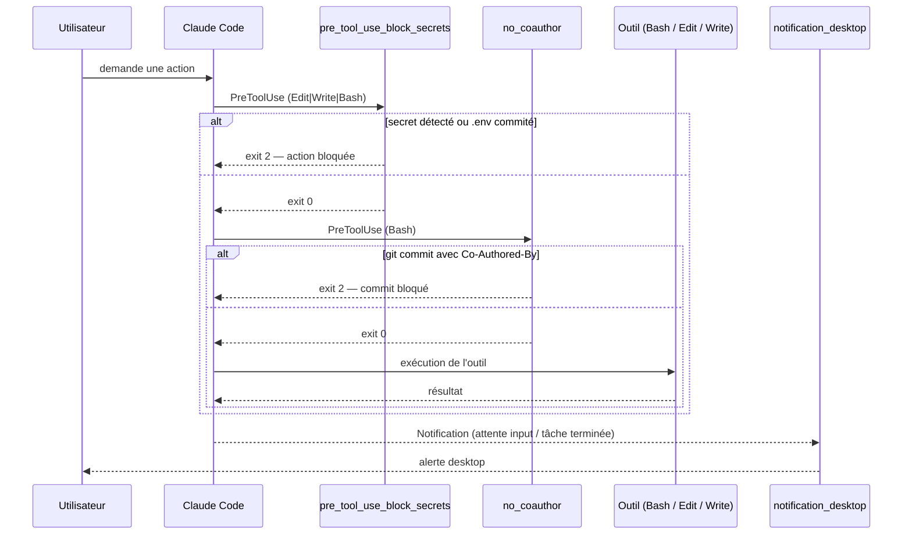

# Setup Claude Code sécurisé

Combine trois hooks du repo en un seul `settings.json` cohérent.
Chaque hook intervient à un stade différent du cycle d'exécution — leur ordre n'est pas arbitraire.

## Flux d'exécution



## Pourquoi cet ordre

`pre_tool_use_block_secrets` utilise le matcher `Edit|Write|Bash` — il s'applique à tout.
`no_coauthor` n'a besoin que de `Bash` — le limiter évite de l'invoquer sur chaque édition de fichier.
Mettre les deux en `PreToolUse` garantit que rien ne passe si l'un des deux bloque.
`notification_desktop` est orthogonal — il n'intervient jamais dans la chaîne de décision.

## settings.json combiné

À fusionner dans `~/.claude/settings.json` (global) ou `.claude/settings.json` (projet) :

```json
{
  "hooks": {
    "PreToolUse": [
      {
        "matcher": "Edit|Write|Bash",
        "hooks": [
          {
            "type": "command",
            "command": "bash \"$CLAUDE_PROJECT_DIR/hooks/404notfood/pre_tool_use_block_secrets/pre_tool_use_block_secrets.sh\""
          }
        ]
      },
      {
        "matcher": "Bash",
        "hooks": [
          {
            "type": "command",
            "command": "bash \"$CLAUDE_PROJECT_DIR/hooks/Baylox/no_coauthor/hook.sh\""
          }
        ]
      }
    ],
    "Notification": [
      {
        "matcher": "",
        "hooks": [
          {
            "type": "command",
            "command": "bash \"$CLAUDE_PROJECT_DIR/hooks/anthropics/notification_desktop/notification_desktop.sh\""
          }
        ]
      }
    ]
  }
}
```

`$CLAUDE_PROJECT_DIR` est exposée nativement par Claude Code — aucun `.env` requis.

## Prérequis

| Hook | Prérequis |
|------|-----------|
| `pre_tool_use_block_secrets` | `jq` dans le PATH |
| `no_coauthor` | aucun |
| `notification_desktop` | `osascript` (macOS) · `notify-send` (Linux) · `powershell.exe` (Windows) |

## Ressources

- [pre_tool_use_block_secrets](../../../hooks/404notfood/pre_tool_use_block_secrets/META.md)
- [no_coauthor](../../../hooks/Baylox/no_coauthor/META.md)
- [notification_desktop](../../../hooks/anthropics/notification_desktop/META.md)
