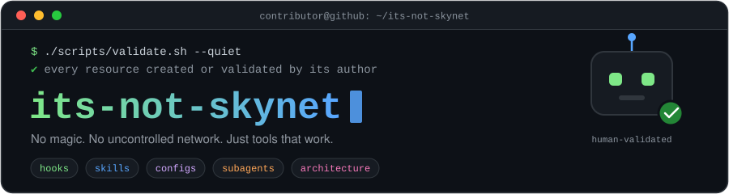
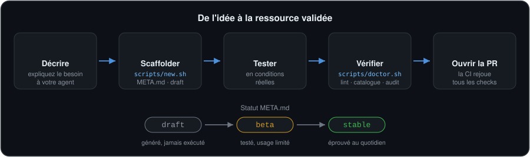

<div align="center">



<br><br>

[](https://github.com/baylox/its-not-skynet/actions/workflows/validate.yml)
[](../LICENSE)
[](../CONTRIBUTING.md)
[](#pourquoi-ce-repo)

**[Démarrage rapide](#démarrage-rapide)** · **[Ce qu'on y trouve](#ce-quon-y-trouve)** · **[Contribuer avec un agent](#contribuer-avec-un-agent)** · **[Outillage](#outillage)** · **[Philosophie](#pourquoi-ce-repo)**

🇬🇧 [English version](../README.md)

</div>

---

## Pourquoi ce repo

L'écosystème des outils IA en CLI déborde de configs copiées-collées, de hooks jamais testés et de skills qui « marchaient sur la machine de quelqu'un ». **its-not-skynet** prend le contre-pied : chaque ressource a été **créée ou testée en conditions réelles** par son auteur.

> [!IMPORTANT]
> **Une seule règle, non négociable :** une ressource est soit **créée**, soit **explicitement validée** par son contributeur. Rien d'importé à l'aveugle. Rien qui dépende d'un réseau non maîtrisé à l'exécution.

Un catalogue de confiance pour quiconque travaille avec des agents CLI IA — Claude Code, Codex CLI, Antigravity CLI, MCP, Ollama, ou tout autre outil.

---

## Ce qu'on y trouve

| Dossier | Description |
|---------|-------------|
| [`hooks/`](../hooks/README.md) | Scripts déclenchés par Claude Code — `PreToolUse`, `PostToolUse`, `Notification`… |
| [`skills/`](../skills/README.md) | Skills réutilisables : slash commands et agents spécialisés |
| [`configs/`](../configs/README.md) | Fichiers de configuration prêts à copier — `settings.json`, `.mcp.json`, Ollama… |
| [`subagents/`](../subagents/README.md) | Définitions de subagents spécialisés |
| [`architecture/`](../architecture/README.md) | Schémas et décisions d'architecture du projet |

Chaque ressource vit dans `<type>/<pseudo-contributeur>/<nom>/` et embarque un **`META.md`** — auteur, statut, usage, installation, environnement testé. C'est le point d'entrée unique pour la comprendre et l'installer.

**Tout parcourir** dans [`CATALOG.md`](../CATALOG.md) (auto-généré, avec statistiques), ou chercher depuis le terminal :

```bash
bash scripts/find.sh -t hooks -s stable        # hooks stables uniquement
bash scripts/find.sh laravel                   # recherche par mot-clé
```

---

## Démarrage rapide

**1.** Choisissez une ressource dans [`CATALOG.md`](../CATALOG.md) ou dans le dossier qui vous intéresse.
**2.** Lisez son `META.md`.
**3.** Installez-la — une commande, zéro copier-coller :

```bash
bash scripts/install.sh skills/<pseudo>/<nom> /chemin/de/votre/projet
```

…ou câblez-la à la main. Exemple pour un hook, dans `.claude/settings.json` :

```jsonc
{
  "hooks": {
    "PreToolUse": [
      {
        "matcher": "Bash",
        "hooks": [
          { "type": "command", "command": "bash \"$CLAUDE_PROJECT_DIR/hooks/Baylox/no_coauthor/hook.sh\"" }
        ]
      }
    ]
  }
}
```

> [!TIP]
> `$CLAUDE_PROJECT_DIR` est exposé nativement par Claude Code — aucun `.env` requis.

---

## Contribuer avec un agent

<div align="center">

</div>

Ouvrez ce repo dans votre agent CLI préféré et décrivez ce que vous voulez :

> *« Je veux un hook qui bloque les commits le vendredi »*

L'agent lit le fichier de contexte du projet et génère la structure complète selon les conventions du repo :

```
hooks/<votre-pseudo>/pre_tool_use_block_friday_commit/
├── pre_tool_use_block_friday_commit.sh
└── META.md
```

Chaque agent CLI a son fichier de contexte :

| Agent | Fichier de contexte |
|-------|---------------------|
| Claude Code | [`CLAUDE.md`](../CLAUDE.md) |
| Codex CLI | [`AGENTS.md`](../AGENTS.md) |
| Antigravity CLI | [`ANTIGRAVITY.md`](../ANTIGRAVITY.md) |

> [!NOTE]
> Les fichiers générés sont toujours des **drafts**. Le statut du `META.md` reste `draft` tant que **vous** n'avez pas exécuté la ressource en conditions réelles. Aucun commit avant validation humaine — c'est la promesse du repo.

**Vous gardez le contrôle, l'agent fait la plomberie.**

Vous préférez le faire à la main ? Forkez, créez votre dossier `<type>/<pseudo>/<nom>/`, ajoutez un `META.md` (template dans [CONTRIBUTING.md](../CONTRIBUTING.md)), testez en conditions réelles, ouvrez une PR.

---

## Outillage

Des outils pur-shell sous [`scripts/`](../scripts/) — déterministes, zéro réseau, aucune dépendance au-delà des coreutils (`jq` optionnel). Le catalogue d'outils CLI validés a ses propres outils CLI validés.

| Script | Ce qu'il fait |
|--------|---------------|
| `doctor.sh` | **Commencez ici.** Bilan pré-PR : lint + synchro catalogue + audit sécurité, avec messages actionnables. `--new <type> <pseudo> <nom>` scaffolde → ouvre `$EDITOR` → lint, en une commande. |
| `new.sh` | Scaffolde une ressource (`new.sh <type> <pseudo> <nom>`) : dossier + `META.md` pré-rempli (statut `draft`) + stub. Les skills reçoivent une description orientée déclenchement et un dossier `references/`. |
| `install.sh` | Installe une ressource dans un projet cible : skill → `.claude/skills/<nom>/`, subagent → `.claude/agents/`, hook → `.claude/hooks/` (avec le snippet `settings.json` pour le câbler). |
| `validate.sh` | Lint chaque ressource : `META.md` présent, sections requises, statut valide, nommage, fichier propre au type. Skills en plus : frontmatter, `name`==dossier, description, liens `references/` cassés/orphelins, budget de lignes. Exit 0/1 — compatible CI. |
| `build-index.sh` | Génère `CATALOG.md` (+ stats) et `index.json` depuis le filesystem. `--check` échoue en cas de désynchro. |
| `find.sh` | Recherche par mot-clé / type / statut / contributeur. |
| `audit-hooks.sh` | Scan sécurité des scripts de hooks — appels réseau à l'exécution, `curl \| sh`, `eval`, `rm -rf`. Consultatif ; supprimez un faux positif avec `# audit:allow`. |
| `test.sh` | Teste l'outillage lui-même sur des fixtures jetables. |

<details>
<summary><strong>Flags communs</strong></summary>

<br>

- Chaque script accepte `--root <dir>` pour cibler un autre repo.
- `validate.sh` / `audit-hooks.sh` : `--quiet` (problèmes uniquement) ; `audit-hooks.sh --strict` sort en 1 sur une alerte `HIGH` (CI).
- `build-index.sh` : `--check` (vérification seule, sans écriture — `index.json` comparé seulement si `jq` est présent), `--no-json`, `--no-readme`.
- `install.sh` : `--dry-run` (aperçu), `--force` (écrase).
- `doctor.sh` : `--fix` (régénère le catalogue au lieu d'échouer), `--new`.

</details>

Une GitHub Action ([`validate.yml`](../.github/workflows/validate.yml)) rejoue `test.sh`, `validate.sh`, `build-index.sh --check` et `audit-hooks.sh --strict` sur chaque PR.

---

## Conventions

| Élément | Règle |
|---------|-------|
| Dossiers hook / subagent | `snake_case` |
| Dossiers skill / config / architecture | `kebab-case` |
| Chemin d'une ressource | `<type>/<pseudo-contributeur>/<nom>/` |
| Hooks | Shell pur privilégié. Toute dépendance LLM doit être déclarée dans le `META.md`. |
| Statut | `stable` — éprouvé au quotidien · `beta` — testé, kilométrage limité · `draft` — généré, jamais exécuté |

---

## Licence

Le travail original des contributeurs est sous **[MIT](../LICENSE)**.

> [!WARNING]
> **La licence MIT ne couvre PAS le contenu tiers.** Les ressources sous `anthropics/` sont la propriété exclusive d'Anthropic, régies uniquement par leurs propres conditions (`LICENSE.txt` Apache-2.0 dans chaque dossier). Voir la section *Third-party content* dans [LICENSE](../LICENSE).

---

<div align="center">

🤖✅ *Construit par des devs qui testent ce qu'ils partagent.*

</div>
